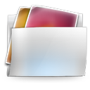

# Crystal Mahjongg

A solitaire mahjongg game written in Crystal Language

## Installation

1. Install Crystal language (version 1.13.1 was used for this but try the latest)
2. open a command line and clone this repo then cd into it
3. ```shards install```
4. ```crystal build src/crystal_mahjongg.cr```

Now run the executable

```./crystal_mahjongg```

## Usage

Click on matching tiles to remove them. You can only remove tiles that are "Free". This means there is no tile above them and they do not have tiles on both the left and right sides of them. They are free if there is just one tile on the left or on the right.  

Tiles "match" if they are identical or if they are in one of the two unique groups of 4 tiles. For the default set used here those unique groups have black squares around their lettering and the lettering is either yellow or black. You can learn more about these tiles from their source site.  https://github.com/jimevins/smooth-tileset

### Icons
Icons are mostly self explanatory but here is a simple reference.

You change the board number! Just use the backspace key and numeric keys then hit the icon start a new game.

 New Game using Board Number in the white box


    Undo Last Move

 Hint - get a possible move


### The following feature are only on Linux

  Changes to Linux only Settings page

 Pick a different picture file with a set of tiles from your personal collection or your hand drawn tiles. See Resources below.

 Change the background color choice

 Replace with game tiles with the new picture file of tiles you found and change in background color

 Close settings without making changes

## Resources

Sources for the default Smooth tile set are open source and available here:
https://github.com/jimevins/smooth-tileset

Icons used in this game were all open source with no restrictions

Open Source Font was found at:
https://www.theleagueofmoveabletype.com/

The Linux version lets you use a file chooser to pick a different image source file for the tiles. This game is compatible with the really old Kyodai tile sets that were created by fans of various Dos and Windows mahjong games. Most such Fan Art sites have disappeared but a few remain such as this one. Get some while they are still around!

http://strassman.epizy.com/


## Contributors

- [Cynthia Coleman](https://github.com/wileycoleman) - creator and maintainer
